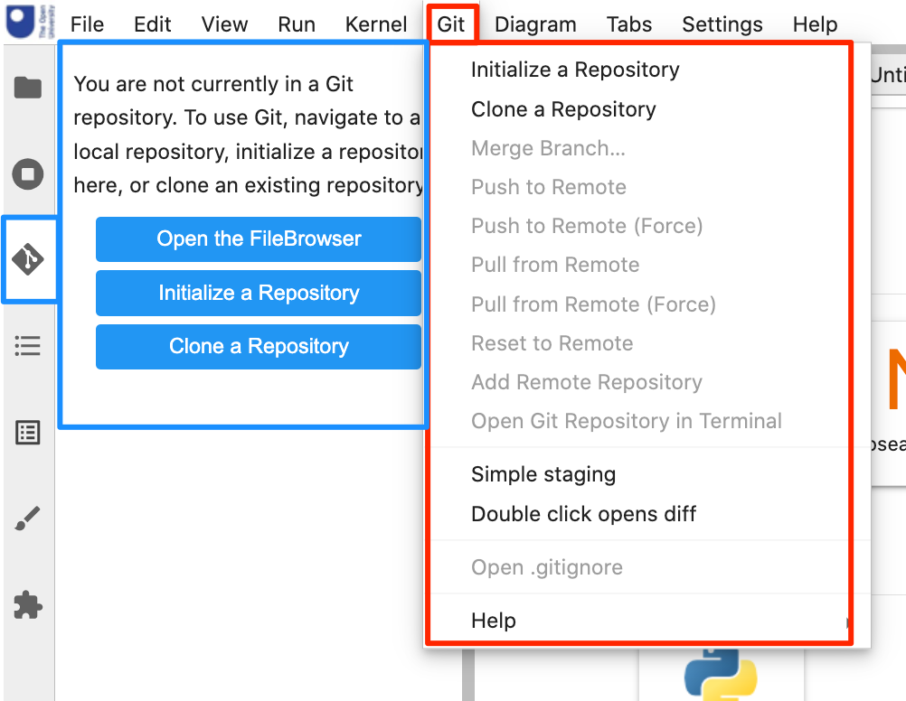
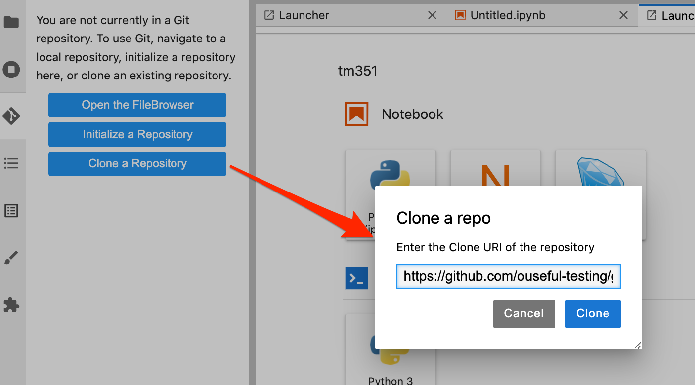
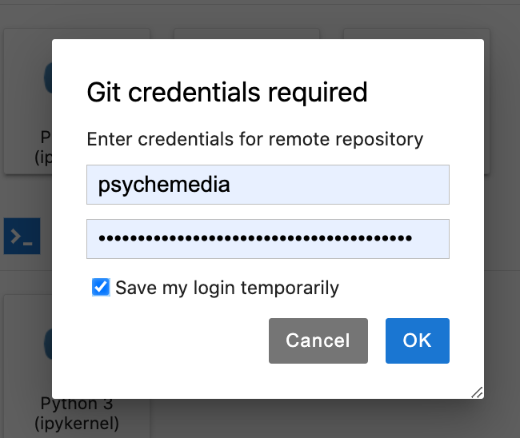
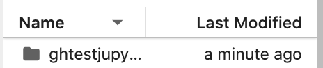
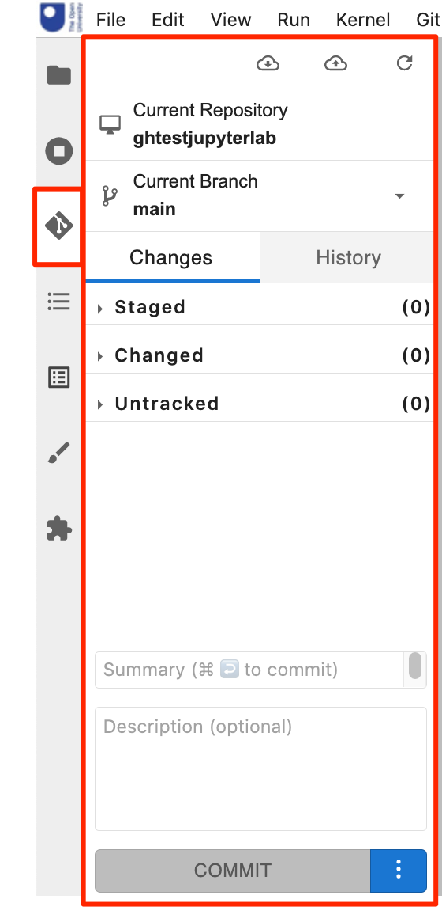
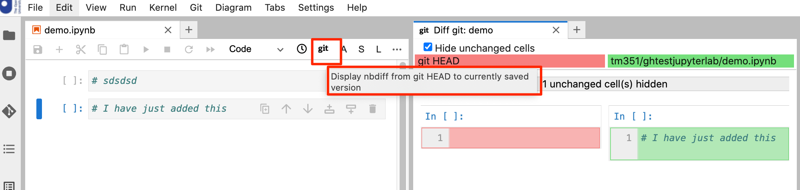

# Using Git and GitHub in JupyterLab

The off-the-shelf [`jupyterlab/jupyterlab-git`](https://github.com/jupyterlab/jupyterlab-git) extension adds various tools to support working with files in `git` managed repositories.

##  `git` Repository and File Management

If the `git` managed repository is configured by cloning a private remote repository on Github, the user is automatically prompted for their GitHub username and token (tokens can be set from `https://github.com/settings/tokens/new`; the only permissions that need granting are the permissions over working with repositories).

We can clone a repo from a remote repository, such as GitHub:

We are then prompted for Github credentials. The "password" should actually be a Github API token:

*The temporary persistence of the credential seems a little flaky to me at the moment, but that may be the price students have to pay at the moment for working with this extension... Your browser may also save the credentials into the browser password manager.*

The repository is cloned into a new directory with the same name as the repository name:

If we now enter the repository and select the `git` sidebar palette option, we are provided with a simple git user interface that allows us to stage and view staged files, make commits and make push and pull requests to the parent repository (an authentication prompt is raised for push and pull and actions).

If students create a __private__ Github repository for their module files, they can use this extension to help them manage their files under git control, and maintain control over their  files in their own repository. For students working across multiple devices and environments, the Github repository can act as their central file store if they run a Git client on each device they want to access the files from.

## `git ` Differencing

The git extension also provides tools for differencing (diffing) files, which is to say, comparing different versions of files. On the first commit, you should provide an email address and name to identify the commit (if you omit this step, an error will be raised and you will need to add the details manually from the command line (a prompt tells you how to do this).

The `git` button on a notebook will compare the *saved* version of the notebook with the last committed version:

*Note that the notebook is __not__ saved when you click the `git` button, so the visible view of the notebook may differ from the (saved) version that is compared with the last committed version.*

The "clock" icon gives a difference between the file and the last checkpointed version of the notebook. (The checkpointed version is a version that the notebook can be reverted back to. By default, the notebook autosaves regularly but checkpoints are only created by explicit (manual) saves..)

The differencing support is likely to be useful to module terms for production and maintenance and may be useful to students wishing to compare their own versions of notebooks where code in a checkpointed version runs correctly but later modified code doesn't.
