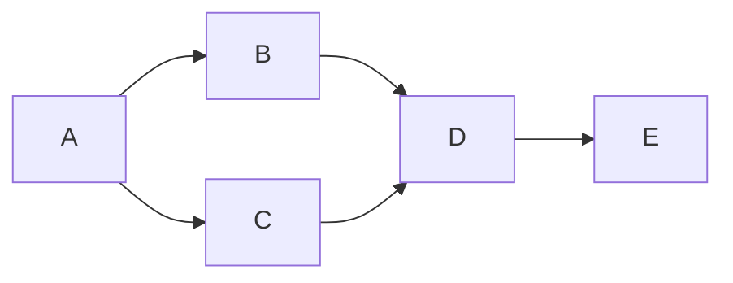

# Using Jupyter Notebooks

Jupyter notebooks are interactive documents that combine editable "content" cells, which may contain structured content written using markdown formatted text, executable "code" cells and executed code cell outputs within a single document.

Notebook code is executed against a notebook kernel. In OU VCEs, notebook kernels are typically provided by self-contained, pre-configured language environments that contain all the required packages necessary for running the module's coding activities.

## Managing notebooks

Notebooks can be created fromn the JupyterLab *Launcher* menu, from the main `File > New > Notebook` menu, or by right-clicking in the file browser and selecting `New Notebook` from the pop-up menu.


```{figure} md_assets/media/notebook_file_browser_popup.png
:name: code_cell_executed
:width: 5.772370953630796in

JupyterLab file browser, context sensitve menu raised on file

A screenshot of the context senstive menu raised from a right-click on a file item in the Jupyeter file browser. The menu shows actions relating to both the notebook, and the directory the notebook is in.

```

By default, files are created with a default `UntitledN.ipynb` filename. Notebook files can be renamed by right-clicking on the file in the file browser and selecting `Rename`, or clicikg on the filename in the JupyterLab notebook and selecting `Rename Notebook...` from the pop-up menu,

## Notebook code kernels

When a notebook is started, a process is started within a prgoramming language kernel environment.


In {{MCODE}}, you will be using notebooks with a {{kernel_language}} language kernel.

As long as the kernel is running (or is hibernated if you hibernate your computer), the values of any variables set within that process will be persisted. That is, the current process *state* will be preserved.

To reset the kernel to an initial empty state, click the notebook toolbar restart button (&#8635;), or select the menu item `Kernel > Restart Kernel`.


## Working with code cells

A new Jupyter notebook is created with a single code cell as a default.

Click in the cell to select and edit it, and then run the cell and move on to the next cell either by the keyboard command — `shift-Enter` — or by clicking the play button (&#9205;) in the notebook toolbar.

On running a code cell, outputs from any `print()` or `display()` statements, as well as the value of any object returned from the last executable code line, will be displayed as code cell output, {numref}`code_cell_executed`

```{figure} md_assets/media/code_cell_executed.png
:name: code_cell_executed
:width: 5.772370953630796in

A screenshot of an executed notebook code cell with lines of code demonstrating the use of print and display commands for rendering code cell output, as well as the display of the value of the object returned by the last line of code in the cell. The play button in the notebook toolbar is also highlighted.
```

You can clear an individual cell's output by right-clicking on the cell and selecting `Clear Cell Output` from the pop-up menu. Clear the output on all cells by selecting `Clear Outputs of All Cells`.

If your program code "hangs" when you try to run it, you can stop the code execution by clicking the stop button (&#9209;) in the notebook toolbar or from the `Kernel > Interrupt Kernel` menu option.

<!--  -->
### Running shell commands from a code cell

In a Python/IPython kernel code cell, you can run a shell command by prefixing the command with a `!`. For example, show the current directory by running `$pwd`.
<!--  -->

### Code cell execution status indicators

The [`jupyterlab_cell_status_extension`](https://github.com/innovationOUtside/jupyterlab_cell_status_extension) provides visual and/or audible indications of the cell run status. The visual indications shown in {numref}`jl_cell_status_indicators` highlight a successfully run cell, a run cell that resulted in an error and a queued/currently running cell. An optional animated "cell flash" effect highlights a code cell that has just completed execution.

```{figure} md_assets/media/cell_status_jl.png
:name: jl_cell_status_indicators
:width: 4in

Cell status indications

Screenshot showing code cells with different cell run status indications: green (success), red (failure), light blue (awaiting execution).

```

This extension also supports a range of audible alerts that signal successful or unsuccessful cell execution, as well as spoken error messages.

*For further information the audio accessibility features, as well as guidance on changing the settings, see {numref}`g-accessibility_jupyterlab-nbv7.md#jupyter-notebook-accessibility` {ref}`g-accessibility_jupyterlab-nbv7.md#jupyter-notebook-accessibility`.*

## Working with Markdown cells

When a cell is run, a new code cell is created beneath it by default. You can change a code cell to a markdown cell using the keyboard shortcut `ESC-M` or by changing the cell type from *Code* to *Markdown* in the notebook toolbar.

In edit mode, you can write markup text using the simple Markdown language. Your VCE may also support use of richer *Myst* markdown syntax.

### Simple Markdown syntax

Markdown is a simple text based mark-up language for writing richly formatted text, using simple text conventions to identify the formatting you want to apply to the text.

For example:

- *italicised text* is identified by wrapping the text in `*` characters: `apply some *emphasis*`;
- __strong__ or __bold__ format can be applied by using a double underscores to wrap the text: `apply __strong__ emphasis`;
- we can also __*combine the two*__: `apply __*combined strong and emphasis*__ markup`.

List items can be created by prefixing each line item with a `-` at the start of the line. Sublist items can be created indenting a list item.

Headers can be included in a markdown cell by prefixing text with one or more `#` signs, correspinding to the cell heading level (for example, `## A level 2 heading`). If a markdown cell starts with a heading, a collapsible cell indicator will be displayed in the rendered cell view that allows you to collapse all cells underneath that heading cell up to the next markdown cell that starts with the same or higher level heading.

The Jupyter markdown editor will preview the styling that will be applied by the use of markdown tags, where possible.

In markdown cell edit mode, markdown text and code comments are also passed through a spell-checker that highlights words that contain spelling errors.

```{figure} md_assets/media/notebook_md_example.png
:name: nb_md_cell_examples
:width: 4in

Notebook markdown cells

Screenshot showing markdown cells in edit and rendered mode.

The cells include a level 1 heading, emphasised and strong text elements, and list and sublist items.
```

You can view the rendered form of a markdown cell by "running" it in the same way that you would run a code cell, using `SHIFT-ENTER`, or from clicking the notebook play button.

Double click on a rendered markdown cell to return it to the edit mode.

#### Inline code and code blocks

You can use `inline code style` by wrapping the text in single backticks: `` here is some `inline code` ``.

You can also include richly formatted code blocks:

```python
# Here is some Python code
def my_function(message):
    """ A hello world function."""
    print(f"The message is: {message}")
```

Wrapping code in triple backtick code fences and identify the language sensitive code styling styling you want to apply (for example, `python`, `R`, `bash`, `text`):

````text
```python
# Here is some Python code
def my_function(message):
    """ A hello world function."""
    print(f"The message is: {message}")
```
````

#### Mathematical notation

You can use `LaTeX` style syntax to describe and render mathematical equations.

For inline expressions, such as $E = mc^2$, wrap the notation in single `$` characters: `$E = mc^2$`.

For block expressions:

$$
\int_0^\infty e^{-x^2} dx = \frac{\sqrt{\pi}}{2}
$$

wrap the code using `$$` fences:

```markdown
$$
\int_0^\infty e^{-x^2} dx = \frac{\sqrt{\pi}}{2}
$$
```


#### Mermaid diagram descriptions

Jupyter notebook markdown cells also support text generated diagrams using [mermaid.js](https://mermaid.js.org/intro/) scripts:

`````text

`````

The rendered cell then displays the corresponding mermaid rendered image, {numref}`jl_mermaid`:

```{figure} md_assets/media/mermaid_diag.png
:name: jl_mermaid
:width: 5.772370953630796in

Example of a rendered mermaid diagram.

Screenshot showing a simple box and arrows chart flowing left to right. A box labeled A is connected by lines and arrows to two boxes, B and C. Boxes B and C are then connected to box D, which in turn is connected to a box E.
```

Being able to *write* diagram descriptions within a markdown cell that are then automatically rendered provides an accessible, text-based way for creating (and editing) diagrams. It removes the need for graphical image editors and can simplify the process of diagram creation. Access to the raw "source code" of the diagram also allows tutors to modify or extend diagrams, as well as easily create and share their own diagrams back with students. See the [`mermaid.js` documentation](https://mermaid.js.org/intro/) for a full description of available diagram types.

<!--  -->
### Rich MyST syntax

As well as simple MyST syntax, support is also provided in markdown cells for enriched MyST flavoured markdown syntax [[docs](https://mystmd.org/guide/quickstart-jupyter-lab-myst)].

For example, the following MyST styled admonition block will be rendered as shown in {numref}`jl_myst_warning`:

`````text
```{warning}
This is a warning block.
```
`````

```{figure} md_assets/media/warning_admonition.png
:name: jl_myst_warning
:width: 4in

Example of a warning admonition

Screenshot showing how a triple backticked warning block is rendered with a warning icon and a cream coloured border between two otherwise unstyled markdown blocks.

```

Other blocks include `danger` (red header bar), `note` (blue), `seealso` (lilac), `important` (light grey-green) and `tip` (light green). The header bars also carry distinguishing leading icons. Using the `{admonition} My Title` style block, a title can be added to the block and the can be styled using the appropriate admonition type set as a `:class:` value. For example, the following block will be rendered as shown in {numref}`jl_myst_warning_title`

`````text
```{admonition} Take this as a warning!
:class: warning

This is a warning block.
```
`````

```{figure} md_assets/media/warning_admonition_title.png
:name: jl_myst_warning_title
:width: 4in

MyST syntax admonition block with a title, styled as a warning, between two otherwise unstyled markdown blocks.

```
<!--  -->

## Coloured cell backgrounds

Many of the notebooks used in OU modules used coloured cell backgrounds to indicate different types of content within a notebook, using four thematically coloured background cells, as shown in {numref}`jl_empinken`. Cell backgrounds are persistent and are toggled from notebook toolbar buttons.

- *activity* (blue): cells that describe activities or exercises;
- *learner* (yellow): cells that students are expected to modify as part of their learning or assessment.;
- *tutor* (pink): important information, or text added as feedback by a tutor on assessed material;
- *solution/success* (green): used to indicate a worked solution or successful outcome.

```{figure} md_assets/media/empinken-new-buttons.png
:name: jl_empinken
:width: 5.772370953630796in

A screenshot of "empinken" extension coloured background cells, used to identify different cell roles.

Four coloured cell types (both markdown and code cells) are shown: blue, yellow, pink and green.

```

The toggle buttons can be individually enabled / disabled; the colours applied to each cell type are also user customisable via user settings as shown in {numref}`jl_empinken_prefs`.

```{figure} md_assets/media/empinken_jl_prefs.png
:name: jl_empinken_prefs
:width: 5.772370953630796in
Screenshot of empinken extension user settings

Options are shown that allow a user to control whether a toolbar button is displayed, whether particular cell backgrounds are rendered, and the colour used to render each background.

```

## Navigating notebooks

The Jupyter environments provide a dynamically generated table of contents listing for a selected notebook from the left hand sidebar palette, {numref}`jl_contents`.

```{figure} md_assets/media/jl_content_list.png
:name: jl_contents
:width: 5.772370953630796in

JupyterLab notebook table of contents

Sidebar showing a table of contents navigation tool generated from the headings in a selected open notebook.

```

<!--  -->
*In the Jupyter Notebook v7 environment, open the table of contents from the Notebook `View -> Table of Contents` menu (`shift-command-k` keyboard shortcut).*
<!--  -->

The table of contents offers two main benefits:

- it provides an overview of the whole document and signposts key, headed elements within it;

- it provides an effective way of navigating to different parts of the document.
