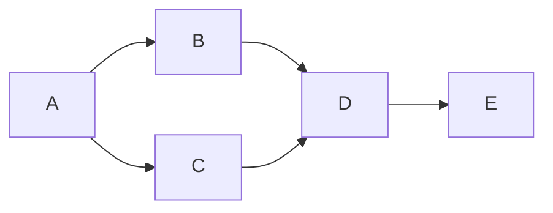

# Using the VCE

When the VCE is fully initialised, you will see the contents page for the JupyterLab environment as shown in {numref}`jupyterlab_home`.

```{figure} md_assets/media/jupyterlab_ui.png
:name: jupyterlab_home
:width: 5.772370953630796in

The JupyterLab user interface

A screenshot of the JupyterLab interactive development environment (IDE) syle user interface, showing a file browser sidebar, document and application launcher, opened document and terminal editors and a menu toolbar.

```

JupyterLab provides an integrated development environment (IDE) that provides access to a file broiwser and a wide range of file editors, including a fully featured Jupyter notebook editor.

The JupyterLab environment distributed as part of the VCE includes several preinstalled JupyterLab extensions to improve the usability of the environment and support your studies.

```{note}
The JupyterLab extensions that have been preinstalled into the VCE may differ from module to module.

Some modules may distribute a "JupyterLab configuration pack" as a separately installable Python package. Such packages can be used to extend your own JupyterLab environment outside of the VCE in a way that matches the customisation of the environment within the VCE.

For example, the Jupyterlab environment in the TM351 VCE is extended using the Python package [`ou-tm351-jl-extensions`](https://pypi.org/project/ou-tm351-jl-extensions/).

```

## Visual Design of Environments

The visual environment is modified using several extensions:

- [`innovationOUtside/jupyterlab_ou_brand_extension`](https://github.com/innovationOUtside/jupyterlab_ou_brand_extension)

This extension adds OU logos to the JupyterLab environment, {numref}`jl_branding`; *(the favicon has been updated to the new OU logo since the screenshot below was taken)*:

```{figure} md_assets/media/ou_jl_branding.png
:name: jl_branding
:width: 5.772370953630796in

JupyterLab environment with OU branding

```

Part of the reason for using an OU branded JupyterLab environment is to give you the sense of a "place to go" when working on VCE based activities or materials. You should follow appropriate behaviour when working inside the environment, particularly if the documents that are produced are shared with others, either through live collaboration, or sumnitted as assessment materials.

- [`innovationOUtside/jupyterlab_empinken_extension`](https://github.com/innovationOUtside/jupyterlab_empinken_extension)

This extension supports four thematically coloured background cells that identify how to interpret different sections of a notebook, {numref}`jl_empinken`. Cell backgrounds are persistent and are toggled from notebook toolbar buttons.

- *activity* (blue): cells that describe activities or exervcies;
- *learner* (yellow): calls yo action, where you are expected to modify the cell contents;
- *tutor* (pink): warning text, or text added as feedback by a tutor on assessed material;
- *solution/success* (green): occasionally used to signify a "correct" answer to a task. 

```{figure} md_assets/media/empinken_jl.png
:name: jl_empinken
:width: 5.772370953630796in

A screenshot of "empinken" extension coloured background cells, used to identify differnt cell roles.

Four coloured cell types (both markdown and code cells) are shown: blue, yellow, pink and green.

```

The toggle buttons can be individually enabled / disabled; the colours applied to each cell type are also user customisable via user settings, {numref}`jl_empinken_prefs`:

```{figure} md_assets/media/empinken_jl_prefs.png
:name: jl_empinken_prefs
:width: 5.772370953630796in
Screenshot of empinken extension user settings

Options are shown that allow a user to control whether a toolbar button is displayed, whether particular cell backgrounds are rendered, and the colour used to render each background.

```

- [`innovationOUtside/jupyterlab_cell_status_extension`](https://github.com/innovationOUtside/jupyterlab_cell_status_extension)

This extension provides a visual indication of the cell run status, {numref}`jl_cell_status_indicator`. It highlights queued/currently running cells, successfully run cells and run cells that errored:

```{figure} md_assets/media/cell_status_jl.png
:name: jl_cell_status_indicator
:width: 4in

Cell status indications

Screenshot showing code cells with different cell run statius indications: gree (success), red (failure), light blue (awaiting execution).

```

*A separate, off the shelf extension, [`jupyterlab-contrib/jupyterlab-cell-flash`](https://github.com/jupyterlab-contrib/jupyterlab-cell-flash) can be used to provide an animated "flash" effect to highlight a cell that has just completed execution).*


## Enriched Display

The JupyterLab environment provides a dynamically generated table of contents listing for notebooks from the left hand sidebar palette, {numref}`jl_contents`:

```{figure} md_assets/media/jl_content_list.png
:name: jl_contents
:width: 5.772370953630796in

JupyterLab notebook table of contents

Sidebar showing a table of contents navigation tool generated from the headings in a selected open notebook.

```

The table of contents has two benefits:

- it provides an overview of the whole document and signposts key, headed elements within it;
- it provides an effective way of navigating to different parts of the document.

Several extensions support the rendering of enriched markdown in JupyterLab and RetroLab notebooks, powered by the [`agoose77/jupyterlab-markup`](https://github.com/agoose77/jupyterlab-markup) package. These include:

- the [`executablebooks/jupyterlab-myst`](https://github.com/executablebooks/jupyterlab-myst) extension is under active devleopment and renders MyST style admonition blocks included in markdown cells in an appropriately styled way;

- [`agoose77/markdown-it-mermaid`](https://github.com/agoose77/markdown-it-mermaid), which is imported natively by `jupyterlab-markup`; this extension allows you to render a wide varietyy of text defined diagrams expressed in code fenced markdown using the [`mermaid.js` package](https://mermaid-js.github.io/mermaid/). Diagram types include flowcharts, sequence diagrams, class diagrams, state diagrams, entity relationship diagrams, Gantt charts and other diagram types.

For example, the following MyST styled admonition block will be rendered as show in {numref}`jl_myst_warning`:

`````
```{warning}
This is a warning block.
```
`````

```{figure} md_assets/media/warning_admonition.png
:name: jl_myst_warning
:width: 4in

Example of a warning admonition

Screenshot showing how a triple backticked warning block is rendered with a warning icon and a cream coloured border between two otherwise unstyled markdown blocks.

```

Other blocks include `danger` (red header bar), `note` (blue), `seealso` (lilac), `important` (light grey-green) and `tip` (light green). The header bars also carry distinguishing leading icons. Using the `{admonition} My Title` style block, a title can be added to the block and the can be styled using the appropriate admonition type set as a `:class:` value. For example, the following block will be rendered as show in {numref}`jl_myst_warning_title`

`````
```{admonition} Take this as a warning!
:class: warning

This is a warning block.
```
`````

```{figure} md_assets/media/warning_admonition_title.png
:name: jl_myst_warning_title
:width: 4in

MyST syntax admonition block with a title, styled as a warning,m betewwen two otherwise unstyled markdown blocks.

```

The MyST syntax also supports various other rich presentation features, such as panels and tabs, rendering support for which may also become available in JupyterLab notebok editors.

The diagramming support bundled with the `jupyterlab-markup` extension allows mermaid code can be included directly in a markdown cell:

`````

`````

The rendered cell then displays the corresponding mermaid rendered image, {numref}`jl_mermaid`:

```{figure} md_assets/media/mermaid_diag.png
:name: jl_mermaid
:width: 5.772370953630796in

Example of a rendered mermaid diagram.

Screenshot showing a simple box and arrows chart flowing left to right. A box labeled A is connected by lines and arrows to two boxes, B and C. Boxes B and C are then connected to box D, which in turn is connected to a box E.
```

Being able to *write* diagrams that are then automatically rendered provides an accessible, text-based way for creating (and editing) diagrams. It removes the need for graphical image editors and can simplify the process of diagram creation. Access to the raw "source code" of the diagram also allows tutors to modify or extend diagrams, as well as easily create and share their own diagrams back with students.

## File Management

If you are working in a local VCE environment, you can mount files directly from your deskop/host environment into the VCE and then save any changes back to the desktop environment.

However, accessing materials that would you like to save on your personal machine from a hosted enviroment, or accessing materials from one or more devices, presents a significant challenge if we are to prevent inconsistencies arising in the files that are being worked on.

There are two main ways we can address this:

- provide a means of accessing files on the local filesystem;
- provide a means for synchronising files with a file repository.

### Local Filesystem Access

The [`jupyterlab-contrib/jupyterlab-filesystem-access`](https://github.com/jupyterlab-contrib/jupyterlab-filesystem-access) extension adds local file system access to the JupyterLab environment (currently, Chrome browser only).

This extension allows you to select a directory from your local filesytem (which is to say, the files on your own computer) and access that directory from within Jupyter environment *wherever that environment is actually hosted*, {numref}`jl_local_file_list`

```{figure} md_assets/media/jl_local_file_list.png
:name: jl_local_file_list
:width: 5.772370953630796in

Local file browser.

Screenshot of a sidebar that lists files mounted into the browser from the local file system.

```

```{note}
If you are mounting files from your host computer into a local VCE, you can ignore this extension. Its main benefit is to allow you to view and save files on your local computer when using a remote Juptyer VCE.
```

If you are accessing the computational environment via an OU hosted multi-user JupyterHub server, *your desktop files will be visible and editable within the browser*. When code is executed, it is sent to the OU server, executed there, and the result returned for display in the browser. The results of the computation are rendered in the notebook and those rendered outputs are saved back to the original notebook file on host filesystem.

Read and write permissions over the shared directory on the local filesytem are granted to the domain serving the the environment for the duration of a browser session (i.e. as long as at least one tab is open onto the Jupyter server).

This extension works for both the hosted and local container environments, with the following consequences:

- *hosted environment*: students can work on files using the hosted environment that are resident on the student's local machine. This means that students can retain and work from a local copy of their files, rather than files that exist on the server:
  - advantages: for students who always access the remote environment using the same physical, computer, they will work with copies of files that exist on that computer; this means that a student can use a local environment *and* the hosted environment to work on *exactly* the same files.
  - disadvantages: if a student accesses the hosted environment from a different computer, their previously worked on files *will not* be available unless they were manually copied into the persistent file storage provided by the hosted environment.

## Directory / Archive Downloading

The [`jupyterlab-contrib/jupyter-archive`](https://github.com/jupyterlab-contrib/jupyter-archive) extension provides a convenient way of downloading and zipping files from a selected directory, {numref}`jl_download_archive`.

```{figure} md_assets/media/jl_download_archive.png
:name: jl_download_archive
:width: 4in

Download a folder as a zuipped file archive.

Screenshot of context sensitive menu for file directory, with "Download Current Folder as Archive" option selected.

```

This works for local and hosted environments and provides a convenient way to save the contents of a working TMA related directory for use as a submission to the ETMA system.

*Note — this extension could be used as the basis for a custom extension that could run additional quality checks over the contents of a directory to ensure that it meets the requirements of the eTMA system, for example as regards file name validity, size of upload, etc. It might also warn users about the presence of possibly inappropriate files to include in the upload. See the [`innovationOUtside/nb_workflow_tools](https://github.com/innovationOUtside/nb_workflow_tools) package for zip tools that will report on the contents of a zip file.*


## Launcher Buttons

Buttons for proxied applications used in a module can be added to the Launcher and used to launch the applications in new windows, {numref}`jl_launcher_buttons`.

```{figure} md_assets/media/jl_launcher_buttons.png
:name: jl_launcher_buttons
:width: 5.772370953630796in

The JupyterLab application and new document launcher. *Options may vary by VCE.*

Screenshot showing three launcher buttons: Python3 (ipykernel) notebook, nbsearch and OpenRefine.

```


## Integrated Applications and Editors

The JupyterLab environment allows multiple notebooks, and other applications, to be rendered, and arranged as required, within the lab "desktop".

```{note}
Installed and available options may vary by VCE.
```

A couple of applications that might be generally useful for diagrams or annotating images are the `jlab-image-editor` simple image editor and the `draw.io` drawing package.

### Image Editor

The [`jupyterlab-contrib/jlab-image-editor`](https://github.com/jupyterlab-contrib/jlab-image-editor) provides a range of additional image editing tool the the image previewer.

Double clicking an image file in the file listing opens a preview window displaying it containing the image editro controls, {numref}`jl_image_editor`. Simple lines and rectangular shapes can be drawa over the image, and the image can be cropped, rotated etc. Currently, there is no option to add text.

```{figure} md_assets/media/jl_image_editor.png
:name: jl_image_editor
:width: 5.772370953630796in

JupyterLab image editor.

Screenshot showing the JupyterLab UI in which a paintbrush icon in the left hand vertical application toolbar is selected. In the center panel an image editor is displayed, depicting an omage that has been drawn over with a pen stroke. Image efitor menu options can also be seen: crop, rotate, save image as..., filter, flip, draw and clear.,

```


### draw.io Drawing Package

The [`QuantStack//jupyterlab-drawio`](https://github.com/QuantStack/jupyterlab-drawio/) package is an old demostration that might still be useful. It embeds the [`draw.io`](https://drawio-app.com/) app inside JuptyerLab. The application is opened from the Launcher *Diagram* icon, {numref}`jl_diagram_launcher`.

```{figure} md_assets/media/jl_diagram_launcher.png
:name: jl_diagram_launcher
:width: 5.772370953630796in

JupyterLab diagram launcher button.

Screenshot showing the launcher with four buttons displayed in the "Other" launcher section: terminal, diagram (highlighted), text file, markdown file, csv file.

```

Within the editor, you can create your own diagrams using a wide range of diagram primitives, {numref}`jl_drawio_ui`.

```{figure} md_assets/media/jl_drawio.png
:name: jl_drawio_ui
:width: 5.772370953630796in

The draw.io application opened in JupyterLab.

```

Raw (editable) files are saved to the current environment directory as `.dio` files. Unfortunately, there doesnlt appear to be a way to export images, so having drawn a diagram, you would have to screenshot it in order to get an image file corresponding to your diagram.


## Jupyter Notebook Templates

Providing notebook templates opens up a range of possibilities for defining reusable "worksheets" for particular sorts of activity.

Templated notebooks might include boilerplate package imports, as well as offering a notebook structure that models a particular sequence of tasks.

Template notebooks can be added to a full server distribution of JupyerLab using the [`jpmorganchase/jupyterlab_templates`](https://github.com/jpmorganchase/jupyterlab_templates) extension.
